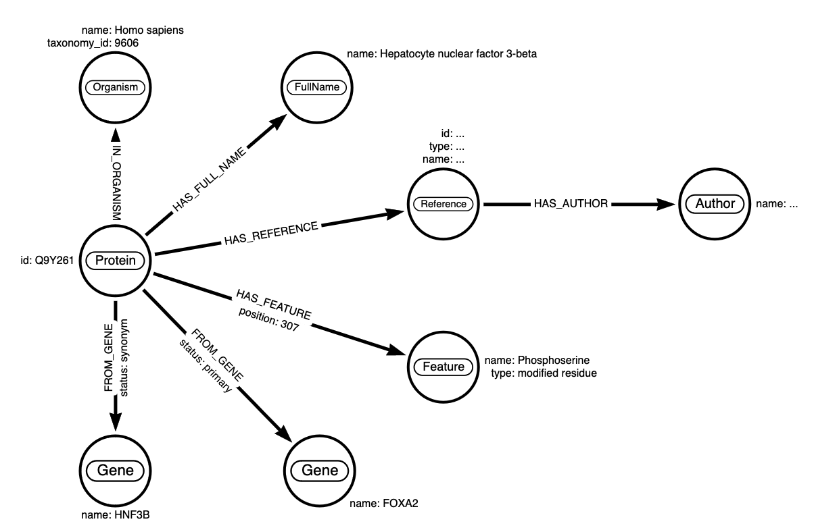
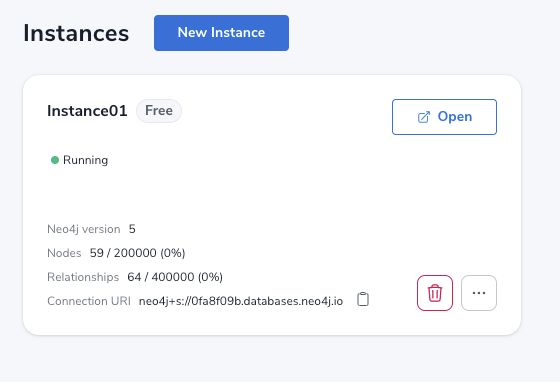
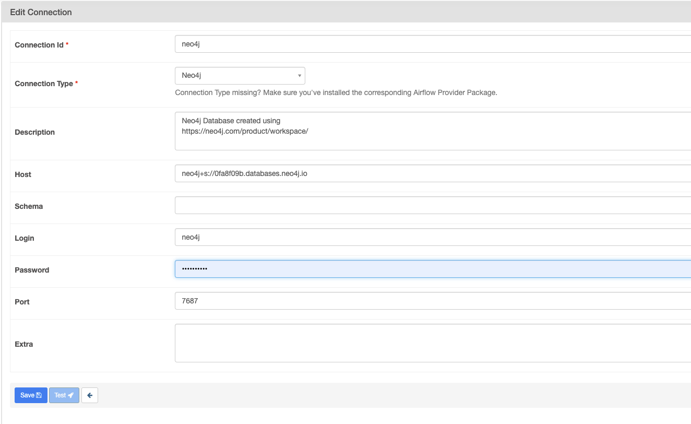
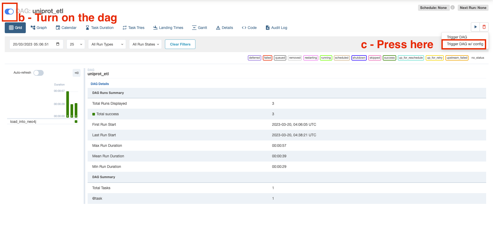
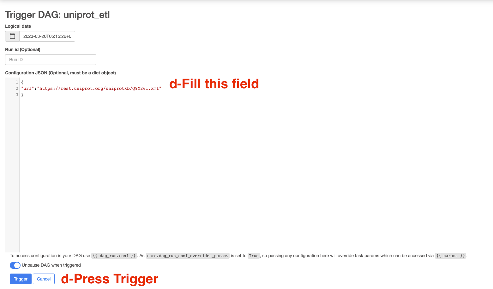
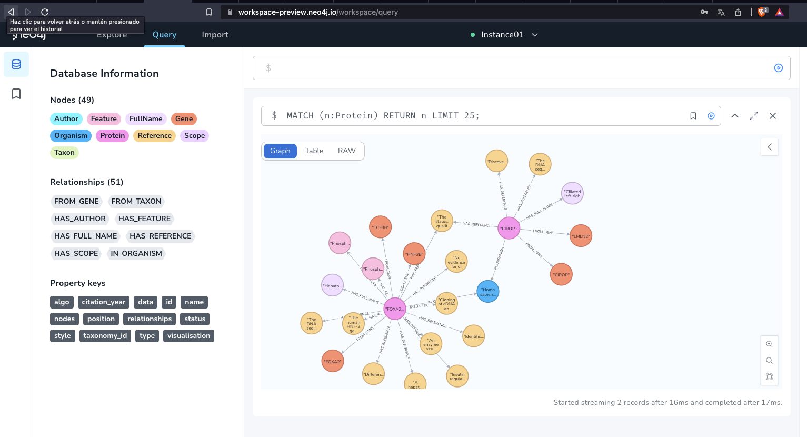

# Data Engineering Coding Challenge

#CONTEXT
> *tl;dr*: The challenge is to create a data pipeline that will ingest a UniProt XML file (`data/Q9Y261.xml`) and store the data in a Neo4j graph database.

> :warning: To apply, email join@weave.bio with 1) the link to your solution repo and 2) your resume.

## Task
Read the XML file `Q9Y261.xml` located in the `data` directory. The XML file contains information about a protein. The task is to create a data pipeline that will ingest the XML file and store as much information as possible in a Neo4j graph database.

## Requirements & Tools
- Use Apache Airflow or a similar workflow management tool to orchestrate the pipeline
- The pipeline should run on a local machine
- Use open-source tools as much as possible

## Source Data
Please use the XML file provided in the `data` directory. The XML file is a subset of the [UniProt Knowledgebase](https://www.uniprot.org/help/uniprotkb).

The XML contains information about proteins, associdated genes and other biological entities. The root element of the XML is `uniprot`. Each `uniprot` element contains a `entry` element. Each `entry` element contains various elements such as `protein`, `gene`, `organism` and `reference`. Use this for the graph data model.

The full XML schema [is available here](https://ftp.uniprot.org/pub/databases/uniprot/current_release/knowledgebase/complete/uniprot.xsd).

## Neo4j Target Database
Please run a Neo4j database locally. You can download Neo4j from https://neo4j.com/download-center/ or run it in Docker:

```
docker run \
  --publish=7474:7474 --publish=7687:7687 \
  --volume=$HOME/neo4j/data:/data \
  neo4j:latest
```

Getting Started with Neo4j: https://neo4j.com/docs/getting-started/current/


## Data Model
The data model should be a graph data model. The graph should contain nodes for proteins, genes, organisms, references, and more. The graph should contain edges for the relationships between these nodes. The relationships should be based on the XML schema. For example, the `protein` element contains a `recommendedName` element. The `recommendedName` element contains a `fullName` element. The `fullName` element contains the full name of the protein. The graph should contain an edge between the `protein` node and the `fullName` node.

Here is an example for the target data model:




##SETUP Environment

### Neo4j Database
https://neo4j.com/product/workspace/

I configured the neo4j database using the free workspace provided, the creation process is very intuitive and simple. 
Log in and generate the instance. Should see something like this:



### Note: Remember to copy the auto generated password for the neo4j user and the connection url.

1-Open a command terminal go to this project directory

2- Create .env file running this command in the terminal:
```echo -e "AIRFLOW_UID=$(id -u)" > .env```
this should generate a file like this:

```
AIRFLOW_UID=501
AIRFLOW_GID=0
```

3- Build the docker image:
```docker build . -f Dockerfile --tag "airflow_neo4j:0.0.1"```

4-Initialize the database: ```docker-compose up airflow-init```

if the process ran fine you should see something like this
```
airflow-init_1       | Upgrades done
airflow-init_1       | Admin user airflow created
airflow-init_1       | 2.2.3
start_airflow-init_1 exited with code 0
```

5-Run this to lauch a container with airflow image: ```docker-compose up```

6-Once all the services have been successfully started, go to this link http://localhost:8080
and log it using credentials:
```
user:airflow
password:airflow
```

7-Set the connection to neo4j in the Admin->Connections menu. Then press the + button (Add a new record) and set the connection with the data we copied when we set the neo4j instance.

It should look like this:


#### 8- Execute the DAG
Note:I made some changes to the original idea, instead of reading the xml from a file I get it directly from the url sent by DAG run config.

So to execute the DAG do this:
    
    a-Use the search engine to find the DAG uniprot_etl open it
    b-Turn on the dag
    c-Press the play button and the Trigger DAG/config option
    d-Fill the json configuration field with this dictionary: {"url":"https://rest.uniprot.org/uniprotkb/Q9Y261.xml"} OR {"url":"https://rest.uniprot.org/uniprotkb/A0A1B0GTW7.xml"}
    e-Press trigger
    f-The dag will start running



9- Once dag is done, open the neo4j instance and you should see the graph created


10- To close kill container, in the terminal press cmd+c and run this ```docker compose down --volumes --rmi all```


####Improvements:
-Improve modularization: Create a separate class for neo4j functionality.

-Improve existing features and implement more to the neo4j class.

-Use a single xml library


